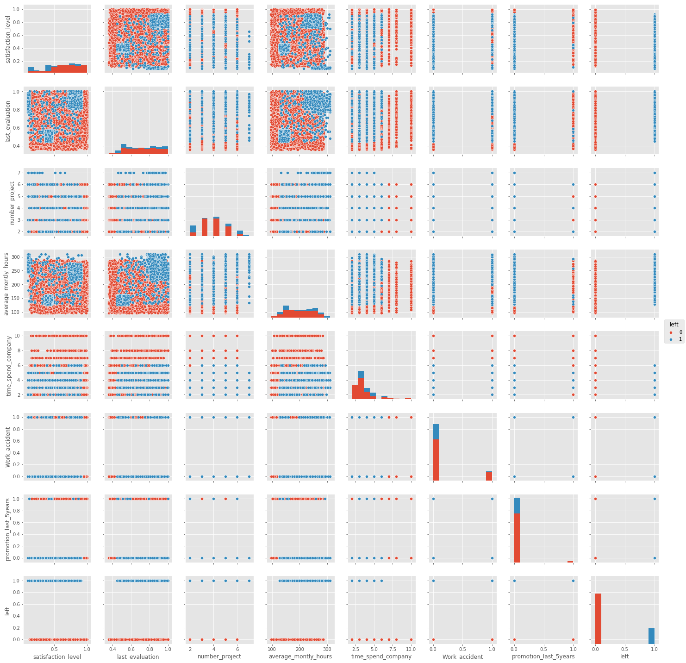
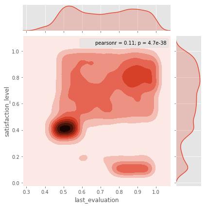
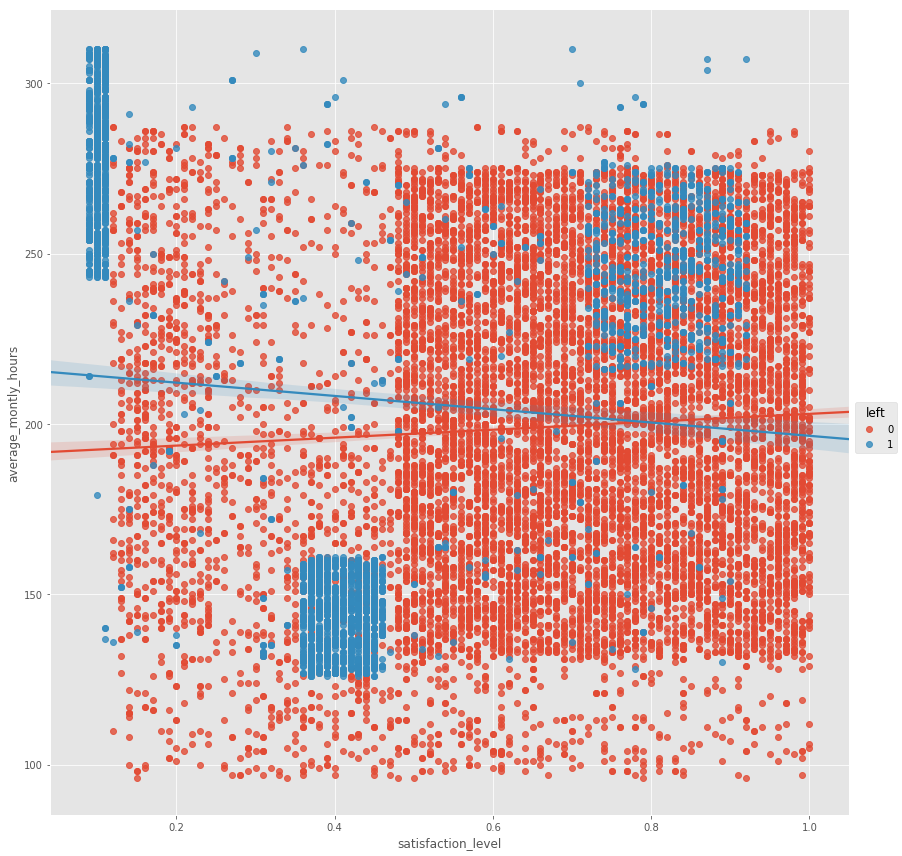
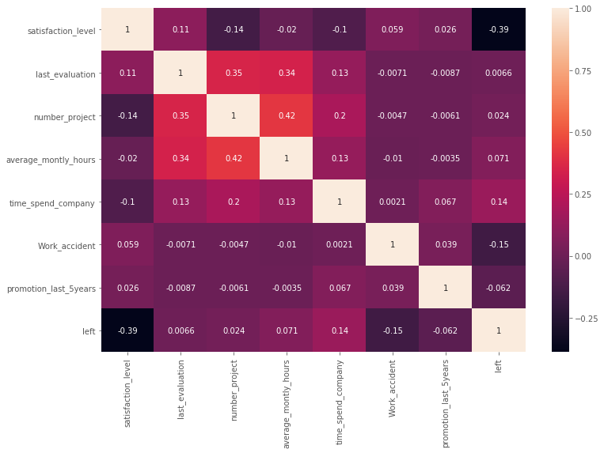
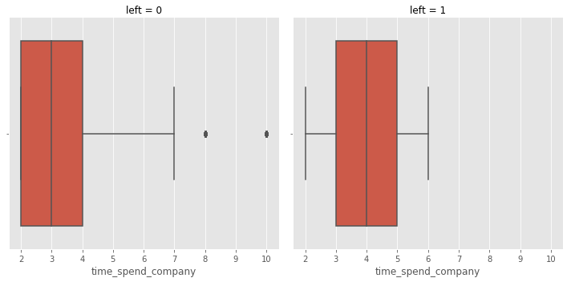
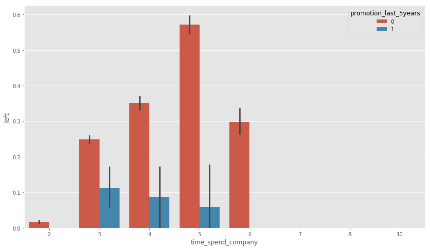
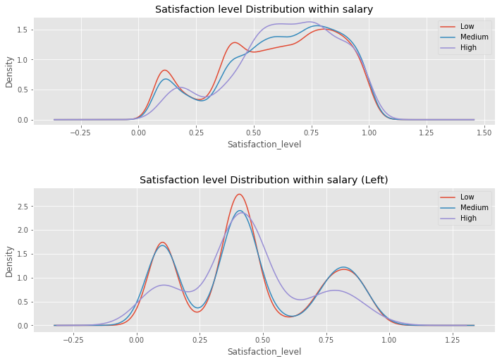
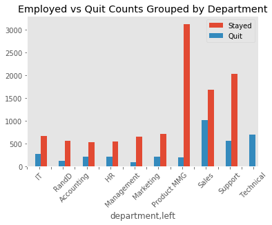
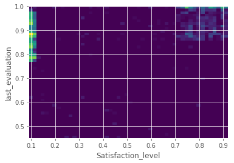
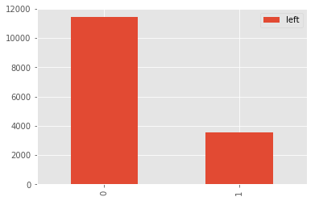

## The Dataset
The reason for the premature leaving of the best and most experienced employees. 

### Aim 
Try to predict which valuable employees will leave next. 

##### Fields in the dataset include:
<ol>
<li>Satisfaction Level</li>
<li>Last evaluation</li>
<li>Number of projects</li>
<li>Average monthly hours</li>
<li>Time spent at the company</li>
<li>Whether they have had a work accident</li>
<li>Whether they have had a promotion in the last 5 years</li>
<li>Departments (column sales)</li>
<li>Salary</li>
<li>Whether the employee has left</li>
</ol>

# Explorative Data Analysis


```python
import pandas as pd
import numpy as np
import matplotlib.pyplot as plt
import seaborn as sns

plt.style.use('seaborn-colorblind')
plt.style.use('ggplot')

%matplotlib inline
```


```python
df = pd.read_csv('HR_comma_sep.csv')
df.head()
```


<div>
<style scoped>
    .dataframe tbody tr th:only-of-type {
        vertical-align: middle;
    }

    .dataframe tbody tr th {
        vertical-align: top;
    }

    .dataframe thead th {
        text-align: right;
    }
</style>
<table border="1" class="dataframe">
  <thead>
    <tr style="text-align: right;">
      <th></th>
      <th>satisfaction_level</th>
      <th>last_evaluation</th>
      <th>number_project</th>
      <th>average_montly_hours</th>
      <th>time_spend_company</th>
      <th>Work_accident</th>
      <th>promotion_last_5years</th>
      <th>sales</th>
      <th>salary</th>
      <th>left</th>
    </tr>
  </thead>
  <tbody>
    <tr>
      <th>0</th>
      <td>0.38</td>
      <td>0.53</td>
      <td>2</td>
      <td>157</td>
      <td>3</td>
      <td>0</td>
      <td>0</td>
      <td>sales</td>
      <td>low</td>
      <td>1</td>
    </tr>
    <tr>
      <th>1</th>
      <td>0.80</td>
      <td>0.86</td>
      <td>5</td>
      <td>262</td>
      <td>6</td>
      <td>0</td>
      <td>0</td>
      <td>sales</td>
      <td>medium</td>
      <td>1</td>
    </tr>
    <tr>
      <th>2</th>
      <td>0.11</td>
      <td>0.88</td>
      <td>7</td>
      <td>272</td>
      <td>4</td>
      <td>0</td>
      <td>0</td>
      <td>sales</td>
      <td>medium</td>
      <td>1</td>
    </tr>
    <tr>
      <th>3</th>
      <td>0.72</td>
      <td>0.87</td>
      <td>5</td>
      <td>223</td>
      <td>5</td>
      <td>0</td>
      <td>0</td>
      <td>sales</td>
      <td>low</td>
      <td>1</td>
    </tr>
    <tr>
      <th>4</th>
      <td>0.37</td>
      <td>0.52</td>
      <td>2</td>
      <td>159</td>
      <td>3</td>
      <td>0</td>
      <td>0</td>
      <td>sales</td>
      <td>low</td>
      <td>1</td>
    </tr>
  </tbody>
</table>
</div>


```python
df.keys()
```


    Index(['satisfaction_level', 'last_evaluation', 'number_project',
           'average_montly_hours', 'time_spend_company', 'Work_accident',
           'promotion_last_5years', 'sales', 'salary', 'left'],
          dtype='object')


```python
df.groupby('left').describe()
```


<div>
<style scoped>
    .dataframe tbody tr th:only-of-type {
        vertical-align: middle;
    }

    .dataframe tbody tr th {
        vertical-align: top;
    }

    .dataframe thead tr th {
        text-align: left;
    }

    .dataframe thead tr:last-of-type th {
        text-align: right;
    }
</style>
<table border="1" class="dataframe">
  <thead>
    <tr>
      <th></th>
      <th colspan="8" halign="left">Work_accident</th>
      <th colspan="2" halign="left">average_montly_hours</th>
      <th>...</th>
      <th colspan="2" halign="left">satisfaction_level</th>
      <th colspan="8" halign="left">time_spend_company</th>
    </tr>
    <tr>
      <th></th>
      <th>count</th>
      <th>mean</th>
      <th>std</th>
      <th>min</th>
      <th>25%</th>
      <th>50%</th>
      <th>75%</th>
      <th>max</th>
      <th>count</th>
      <th>mean</th>
      <th>...</th>
      <th>75%</th>
      <th>max</th>
      <th>count</th>
      <th>mean</th>
      <th>std</th>
      <th>min</th>
      <th>25%</th>
      <th>50%</th>
      <th>75%</th>
      <th>max</th>
    </tr>
    <tr>
      <th>left</th>
      <th></th>
      <th></th>
      <th></th>
      <th></th>
      <th></th>
      <th></th>
      <th></th>
      <th></th>
      <th></th>
      <th></th>
      <th></th>
      <th></th>
      <th></th>
      <th></th>
      <th></th>
      <th></th>
      <th></th>
      <th></th>
      <th></th>
      <th></th>
      <th></th>
    </tr>
  </thead>
  <tbody>
    <tr>
      <th>0</th>
      <td>11428.0</td>
      <td>0.175009</td>
      <td>0.379991</td>
      <td>0.0</td>
      <td>0.0</td>
      <td>0.0</td>
      <td>0.0</td>
      <td>1.0</td>
      <td>11428.0</td>
      <td>199.060203</td>
      <td>...</td>
      <td>0.84</td>
      <td>1.00</td>
      <td>11428.0</td>
      <td>3.380032</td>
      <td>1.562348</td>
      <td>2.0</td>
      <td>2.0</td>
      <td>3.0</td>
      <td>4.0</td>
      <td>10.0</td>
    </tr>
    <tr>
      <th>1</th>
      <td>3571.0</td>
      <td>0.047326</td>
      <td>0.212364</td>
      <td>0.0</td>
      <td>0.0</td>
      <td>0.0</td>
      <td>0.0</td>
      <td>1.0</td>
      <td>3571.0</td>
      <td>207.419210</td>
      <td>...</td>
      <td>0.73</td>
      <td>0.92</td>
      <td>3571.0</td>
      <td>3.876505</td>
      <td>0.977698</td>
      <td>2.0</td>
      <td>3.0</td>
      <td>4.0</td>
      <td>5.0</td>
      <td>6.0</td>
    </tr>
  </tbody>
</table>
<p>2 rows × 56 columns</p>
</div>


```python
sns.pairplot(df, hue='left')
```


    <seaborn.axisgrid.PairGrid at 0x1c155f165c0>





```python
df.info()
```

    <class 'pandas.core.frame.DataFrame'>
    RangeIndex: 14999 entries, 0 to 14998
    Data columns (total 10 columns):
    satisfaction_level       14999 non-null float64
    last_evaluation          14999 non-null float64
    number_project           14999 non-null int64
    average_montly_hours     14999 non-null int64
    time_spend_company       14999 non-null int64
    Work_accident            14999 non-null int64
    promotion_last_5years    14999 non-null int64
    sales                    14999 non-null object
    salary                   14999 non-null object
    left                     14999 non-null int64
    dtypes: float64(2), int64(6), object(2)
    memory usage: 1.1+ MB
    


```python
sns.jointplot(x=df['last_evaluation'], y=df['satisfaction_level'], kind='kde')
```


    <seaborn.axisgrid.JointGrid at 0x1c15a817828>





```python
sns.lmplot(data=df, x='satisfaction_level', y='average_montly_hours', size=12, hue='left')
```


    <seaborn.axisgrid.FacetGrid at 0x1c15b0e4828>





```python
plt.figure(figsize=(12,8))
sns.heatmap(df.corr(), annot=True)
```


    <matplotlib.axes._subplots.AxesSubplot at 0x1c1544572e8>





```python
g = sns.FacetGrid(df, col = 'left', size=5)
g.map(sns.boxplot, 'time_spend_company')
```

    C:\Users\ArpitJainMr\Anaconda3\lib\site-packages\seaborn\axisgrid.py:703: UserWarning: Using the boxplot function without specifying `order` is likely to produce an incorrect plot.
      warnings.warn(warning)
    


    <seaborn.axisgrid.FacetGrid at 0x1c15b0cfc50>





```python
#time spend with promotion
plt.figure(figsize=(14,8))
sns.barplot(x='time_spend_company', y = 'left', hue = 'promotion_last_5years', data = df)
```


    <matplotlib.axes._subplots.AxesSubplot at 0x1c14ea076a0>





# Data Transformation


```python
sal_dummy = pd.get_dummies(df['salary'])
df_new = pd.concat([df, sal_dummy], axis=1)
```


```python
df_new.drop('salary', axis=1, inplace=True)
```


```python
df_new.head()
```


<div>
<style scoped>
    .dataframe tbody tr th:only-of-type {
        vertical-align: middle;
    }

    .dataframe tbody tr th {
        vertical-align: top;
    }

    .dataframe thead th {
        text-align: right;
    }
</style>
<table border="1" class="dataframe">
  <thead>
    <tr style="text-align: right;">
      <th></th>
      <th>satisfaction_level</th>
      <th>last_evaluation</th>
      <th>number_project</th>
      <th>average_montly_hours</th>
      <th>time_spend_company</th>
      <th>Work_accident</th>
      <th>promotion_last_5years</th>
      <th>sales</th>
      <th>left</th>
      <th>high</th>
      <th>low</th>
      <th>medium</th>
    </tr>
  </thead>
  <tbody>
    <tr>
      <th>0</th>
      <td>0.38</td>
      <td>0.53</td>
      <td>2</td>
      <td>157</td>
      <td>3</td>
      <td>0</td>
      <td>0</td>
      <td>sales</td>
      <td>1</td>
      <td>0</td>
      <td>1</td>
      <td>0</td>
    </tr>
    <tr>
      <th>1</th>
      <td>0.80</td>
      <td>0.86</td>
      <td>5</td>
      <td>262</td>
      <td>6</td>
      <td>0</td>
      <td>0</td>
      <td>sales</td>
      <td>1</td>
      <td>0</td>
      <td>0</td>
      <td>1</td>
    </tr>
    <tr>
      <th>2</th>
      <td>0.11</td>
      <td>0.88</td>
      <td>7</td>
      <td>272</td>
      <td>4</td>
      <td>0</td>
      <td>0</td>
      <td>sales</td>
      <td>1</td>
      <td>0</td>
      <td>0</td>
      <td>1</td>
    </tr>
    <tr>
      <th>3</th>
      <td>0.72</td>
      <td>0.87</td>
      <td>5</td>
      <td>223</td>
      <td>5</td>
      <td>0</td>
      <td>0</td>
      <td>sales</td>
      <td>1</td>
      <td>0</td>
      <td>1</td>
      <td>0</td>
    </tr>
    <tr>
      <th>4</th>
      <td>0.37</td>
      <td>0.52</td>
      <td>2</td>
      <td>159</td>
      <td>3</td>
      <td>0</td>
      <td>0</td>
      <td>sales</td>
      <td>1</td>
      <td>0</td>
      <td>1</td>
      <td>0</td>
    </tr>
  </tbody>
</table>
</div>


```python
X = df_new.drop(['sales', 'left', 'high'], axis=1)
y = df_new['left']
```

# Data Predictions

## 1. Random Forest Classifier


```python
from sklearn.cross_validation import train_test_split
```


```python
X_train, X_test, y_train, y_test = train_test_split(X, y, test_size=0.33, random_state=42)
```


```python
from sklearn.ensemble import RandomForestClassifier
```


```python
rfc = RandomForestClassifier(n_estimators=100)
```


```python
rfc.fit(X_train, y_train)
```


    RandomForestClassifier(bootstrap=True, class_weight=None, criterion='gini',
                max_depth=None, max_features='auto', max_leaf_nodes=None,
                min_impurity_decrease=0.0, min_impurity_split=None,
                min_samples_leaf=1, min_samples_split=2,
                min_weight_fraction_leaf=0.0, n_estimators=100, n_jobs=1,
                oob_score=False, random_state=None, verbose=0,
                warm_start=False)


```python
pred = rfc.predict(X_test)
```


```python
from sklearn.metrics import confusion_matrix, classification_report
```


```python
print(confusion_matrix(y_test, pred))
print('\n')
print(classification_report(y_test, pred))
```

    [[3760    9]
     [  47 1134]]
    
    
                 precision    recall  f1-score   support
    
              0       0.99      1.00      0.99      3769
              1       0.99      0.96      0.98      1181
    
    avg / total       0.99      0.99      0.99      4950
    
    


```python
rfc_score_train = rfc.score(X_train, y_train)
print('RFC Train Score:',rfc_score_train)
rfc_score_test = rfc.score(X_test, y_test)
print('RFC Test Score:',rfc_score_test)
```

    RFC Train Score: 1.0
    RFC Test Score: 0.9886868686868687
    

## 2. K Nearest Neighbors Classifier


```python
from sklearn.neighbors import KNeighborsClassifier
```


```python
knn = KNeighborsClassifier(n_neighbors=10)
```


```python
knn.fit(X_train, y_train)
```


    KNeighborsClassifier(algorithm='auto', leaf_size=30, metric='minkowski',
               metric_params=None, n_jobs=1, n_neighbors=10, p=2,
               weights='uniform')


```python
knn_pred = knn.predict(X_test)
```


```python
print(confusion_matrix(y_test, knn_pred))
print('\n')
print(classification_report(y_test, knn_pred))
```

    [[3586  183]
     [ 109 1072]]
    
    
                 precision    recall  f1-score   support
    
              0       0.97      0.95      0.96      3769
              1       0.85      0.91      0.88      1181
    
    avg / total       0.94      0.94      0.94      4950
    
    


```python
knn_score_train = knn.score(X_train, y_train)
print('KNN Train Score:', knn_score_train)
knn_score_test = knn.score(X_test, y_test)
print('KNN Test Score:', knn_score_test)
```

    KNN Train Score: 0.9506418549109364
    KNN Test Score: 0.941010101010101
    

## 3. Logistic Regression


```python
from sklearn.linear_model import LogisticRegression
```


```python
lreg = LogisticRegression()
```


```python
lreg.fit(X_train, y_train)
```


    LogisticRegression(C=1.0, class_weight=None, dual=False, fit_intercept=True,
              intercept_scaling=1, max_iter=100, multi_class='ovr', n_jobs=1,
              penalty='l2', random_state=None, solver='liblinear', tol=0.0001,
              verbose=0, warm_start=False)


```python
reg_pred = lreg.predict(X_test)
```


```python
print(confusion_matrix(y_test, reg_pred))
print('\n')
print(classification_report(y_test, reg_pred))
```

    [[3480  289]
     [ 810  371]]
    
    
                 precision    recall  f1-score   support
    
              0       0.81      0.92      0.86      3769
              1       0.56      0.31      0.40      1181
    
    avg / total       0.75      0.78      0.75      4950
    
    


```python
lreg_score_train = lreg.score(X_train, y_train)
print("Logistic Regression Train Score:", lreg_score_train)
lreg_score_test = lreg.score(X_test, y_test)
print('Logistic Regression Test Score:', lreg_score_test)
```

    Logistic Regression Train Score: 0.7893322718678476
    Logistic Regression Test Score: 0.777979797979798
    

# Relationships Analyzed
#### Exploring Further Relationships
<ol>
<li>Satisfaction level vs average monthly hours </li>
<li>Department with highest turnover</li>
<li>last evaluation vs satisfaction level</li>
<li>Deeper analysis of regretted attrition:
    <ul>
    <li>Did they have a recent promotion </li>
    <li>Did they spend too much time at work</li>
    <li>Work accident</li>
    <li>Number of projects</li>
    <li>Last evaluations</li>
    </ul>    
</li> 
</ol>    


```python
import statsmodels.api as sm
from statsmodels.nonparametric.kde import KDEUnivariate
from statsmodels.nonparametric import smoothers_lowess
from pandas import Series, DataFrame
from patsy import dmatrices
from sklearn import datasets, svm
```


```python
df = pd.read_csv('HR_comma_sep.csv')
df.columns
df = df.rename(columns={'sales': 'department'})
```


```python
#isolate the data of those that have quit (left)
dfleft = df[df["left"]==1]
dfstay = df[df["left"]==0]
```


```python
#Did salary have an influence on the quitting rate of employees?
dfsalaryleft = dfleft.salary.value_counts().sort_index()
dfsalarystay = dfstay.salary.value_counts().sort_index()
```


```python
#A look into the distribution rates of Salary vs Satisfaction
fig = plt.figure(figsize=(10,20)) 

plt.subplot2grid((8,2),(0,0), colspan=2)
df.satisfaction_level[df.salary == 'low'].plot(kind='kde')    
df.satisfaction_level[df.salary == 'medium'].plot(kind='kde') 
df.satisfaction_level[df.salary == 'high'].plot(kind='kde') 
# plots an axis lable
plt.tight_layout()
plt.xlabel("Satisfaction_level")    
plt.title("Satisfaction level Distribution within salary")
# sets our legend for our graph.
plt.legend(('Low', 'Medium','High'),loc='best') 

plt.subplot2grid((6,2),(1,0), colspan=2)
dfleft.satisfaction_level[dfleft.salary == 'low'].plot(kind='kde')    
dfleft.satisfaction_level[dfleft.salary == 'medium'].plot(kind='kde') 
dfleft.satisfaction_level[dfleft.salary == 'high'].plot(kind='kde') 
# plots an axis lable
plt.xlabel("Satisfaction_level")    
plt.title("Satisfaction level Distribution within salary (Left)")
# sets our legend for our graph.
plt.legend(('Low', 'Medium','High'),loc='best')

```


    <matplotlib.legend.Legend at 0x1c15bc655f8>





```python
#An analysis of the Employed vs Left employees grouped by Department
depleft = df[['department','left']]
depleft1 = depleft.groupby(['department', 'left'])
ind = np.arange(20)                # the x locations for the groups
width = 0.35                      # the width of the bars
#print (depleft1['left'].value_counts())

#Without the hierarchical indexing
#print ("[Unstacking]")
depleft1sum = depleft1['left'].value_counts().unstack()
#print (depleft1sum)

ax = depleft1sum.plot(kind = 'bar', width = 1,  align='center')

ax.set_xlim(width)
ax.set_ylim(0,3300)
xTickMarks = ['','IT','','RandD','Accounting','','','HR','Management','','Marketing','','Product MMG','','','Sales','','Support','','Technical']
ax.set_xticks(ind+width)
xtickNames = ax.set_xticklabels(xTickMarks)
ax.set_title('Employed vs Quit Counts Grouped by Department')
plt.setp(xtickNames, rotation=45, fontsize=10)
plt.legend(('Stayed', 'Quit'),loc='best') 

#plt.ylabel(‘Num’)
plt.grid()
plt.show()
```





```python
#Analysis of regretted attrition 
#last evalutions > .85, number_project > 5, promotion_last_5years = 1
#df[(df["LATITUDE"] == '37.869058') | (df["LONGITUDE"] == '-122.270455')]

retention = dfleft[(dfleft["number_project"] > 5) | (dfleft["promotion_last_5years"] == 1)| (dfleft["last_evaluation"] > .85)]
retention = retention[['satisfaction_level','last_evaluation','promotion_last_5years','salary','number_project']]
retention.head()
```


<div>
<style scoped>
    .dataframe tbody tr th:only-of-type {
        vertical-align: middle;
    }

    .dataframe tbody tr th {
        vertical-align: top;
    }

    .dataframe thead th {
        text-align: right;
    }
</style>
<table border="1" class="dataframe">
  <thead>
    <tr style="text-align: right;">
      <th></th>
      <th>satisfaction_level</th>
      <th>last_evaluation</th>
      <th>promotion_last_5years</th>
      <th>salary</th>
      <th>number_project</th>
    </tr>
  </thead>
  <tbody>
    <tr>
      <th>1</th>
      <td>0.80</td>
      <td>0.86</td>
      <td>0</td>
      <td>medium</td>
      <td>5</td>
    </tr>
    <tr>
      <th>2</th>
      <td>0.11</td>
      <td>0.88</td>
      <td>0</td>
      <td>medium</td>
      <td>7</td>
    </tr>
    <tr>
      <th>3</th>
      <td>0.72</td>
      <td>0.87</td>
      <td>0</td>
      <td>low</td>
      <td>5</td>
    </tr>
    <tr>
      <th>6</th>
      <td>0.10</td>
      <td>0.77</td>
      <td>0</td>
      <td>low</td>
      <td>6</td>
    </tr>
    <tr>
      <th>8</th>
      <td>0.89</td>
      <td>1.00</td>
      <td>0</td>
      <td>low</td>
      <td>5</td>
    </tr>
  </tbody>
</table>
</div>


```python
# Generate some test data
x = retention.satisfaction_level
y = retention.last_evaluation

heatmap, xedges, yedges = np.histogram2d(x, y, bins=50)
extent = [xedges[0], xedges[-1], yedges[0], yedges[-1]]

plt.clf()
plt.imshow(heatmap.T, extent=extent, origin='lower')
plt.xlabel('Satisfaction_level')
plt.ylabel('last_evaluation')
plt.show()
```





```python
dummies=pd.get_dummies(df['department'],prefix='sales')
df=pd.concat([df,dummies],axis=1)
df.drop(['department'],axis=1,inplace=True)
df.head(10)
```


<div>
<style scoped>
    .dataframe tbody tr th:only-of-type {
        vertical-align: middle;
    }

    .dataframe tbody tr th {
        vertical-align: top;
    }

    .dataframe thead th {
        text-align: right;
    }
</style>
<table border="1" class="dataframe">
  <thead>
    <tr style="text-align: right;">
      <th></th>
      <th>satisfaction_level</th>
      <th>last_evaluation</th>
      <th>number_project</th>
      <th>average_montly_hours</th>
      <th>time_spend_company</th>
      <th>Work_accident</th>
      <th>promotion_last_5years</th>
      <th>salary</th>
      <th>left</th>
      <th>sales_IT</th>
      <th>sales_RandD</th>
      <th>sales_accounting</th>
      <th>sales_hr</th>
      <th>sales_management</th>
      <th>sales_marketing</th>
      <th>sales_product_mng</th>
      <th>sales_sales</th>
      <th>sales_support</th>
      <th>sales_technical</th>
    </tr>
  </thead>
  <tbody>
    <tr>
      <th>0</th>
      <td>0.38</td>
      <td>0.53</td>
      <td>2</td>
      <td>157</td>
      <td>3</td>
      <td>0</td>
      <td>0</td>
      <td>low</td>
      <td>1</td>
      <td>0</td>
      <td>0</td>
      <td>0</td>
      <td>0</td>
      <td>0</td>
      <td>0</td>
      <td>0</td>
      <td>1</td>
      <td>0</td>
      <td>0</td>
    </tr>
    <tr>
      <th>1</th>
      <td>0.80</td>
      <td>0.86</td>
      <td>5</td>
      <td>262</td>
      <td>6</td>
      <td>0</td>
      <td>0</td>
      <td>medium</td>
      <td>1</td>
      <td>0</td>
      <td>0</td>
      <td>0</td>
      <td>0</td>
      <td>0</td>
      <td>0</td>
      <td>0</td>
      <td>1</td>
      <td>0</td>
      <td>0</td>
    </tr>
    <tr>
      <th>2</th>
      <td>0.11</td>
      <td>0.88</td>
      <td>7</td>
      <td>272</td>
      <td>4</td>
      <td>0</td>
      <td>0</td>
      <td>medium</td>
      <td>1</td>
      <td>0</td>
      <td>0</td>
      <td>0</td>
      <td>0</td>
      <td>0</td>
      <td>0</td>
      <td>0</td>
      <td>1</td>
      <td>0</td>
      <td>0</td>
    </tr>
    <tr>
      <th>3</th>
      <td>0.72</td>
      <td>0.87</td>
      <td>5</td>
      <td>223</td>
      <td>5</td>
      <td>0</td>
      <td>0</td>
      <td>low</td>
      <td>1</td>
      <td>0</td>
      <td>0</td>
      <td>0</td>
      <td>0</td>
      <td>0</td>
      <td>0</td>
      <td>0</td>
      <td>1</td>
      <td>0</td>
      <td>0</td>
    </tr>
    <tr>
      <th>4</th>
      <td>0.37</td>
      <td>0.52</td>
      <td>2</td>
      <td>159</td>
      <td>3</td>
      <td>0</td>
      <td>0</td>
      <td>low</td>
      <td>1</td>
      <td>0</td>
      <td>0</td>
      <td>0</td>
      <td>0</td>
      <td>0</td>
      <td>0</td>
      <td>0</td>
      <td>1</td>
      <td>0</td>
      <td>0</td>
    </tr>
    <tr>
      <th>5</th>
      <td>0.41</td>
      <td>0.50</td>
      <td>2</td>
      <td>153</td>
      <td>3</td>
      <td>0</td>
      <td>0</td>
      <td>low</td>
      <td>1</td>
      <td>0</td>
      <td>0</td>
      <td>0</td>
      <td>0</td>
      <td>0</td>
      <td>0</td>
      <td>0</td>
      <td>1</td>
      <td>0</td>
      <td>0</td>
    </tr>
    <tr>
      <th>6</th>
      <td>0.10</td>
      <td>0.77</td>
      <td>6</td>
      <td>247</td>
      <td>4</td>
      <td>0</td>
      <td>0</td>
      <td>low</td>
      <td>1</td>
      <td>0</td>
      <td>0</td>
      <td>0</td>
      <td>0</td>
      <td>0</td>
      <td>0</td>
      <td>0</td>
      <td>1</td>
      <td>0</td>
      <td>0</td>
    </tr>
    <tr>
      <th>7</th>
      <td>0.92</td>
      <td>0.85</td>
      <td>5</td>
      <td>259</td>
      <td>5</td>
      <td>0</td>
      <td>0</td>
      <td>low</td>
      <td>1</td>
      <td>0</td>
      <td>0</td>
      <td>0</td>
      <td>0</td>
      <td>0</td>
      <td>0</td>
      <td>0</td>
      <td>1</td>
      <td>0</td>
      <td>0</td>
    </tr>
    <tr>
      <th>8</th>
      <td>0.89</td>
      <td>1.00</td>
      <td>5</td>
      <td>224</td>
      <td>5</td>
      <td>0</td>
      <td>0</td>
      <td>low</td>
      <td>1</td>
      <td>0</td>
      <td>0</td>
      <td>0</td>
      <td>0</td>
      <td>0</td>
      <td>0</td>
      <td>0</td>
      <td>1</td>
      <td>0</td>
      <td>0</td>
    </tr>
    <tr>
      <th>9</th>
      <td>0.42</td>
      <td>0.53</td>
      <td>2</td>
      <td>142</td>
      <td>3</td>
      <td>0</td>
      <td>0</td>
      <td>low</td>
      <td>1</td>
      <td>0</td>
      <td>0</td>
      <td>0</td>
      <td>0</td>
      <td>0</td>
      <td>0</td>
      <td>0</td>
      <td>1</td>
      <td>0</td>
      <td>0</td>
    </tr>
  </tbody>
</table>
</div>


```python
dfdeptleft = dfleft.department.value_counts().sort_index().to_frame()
dfdeptstay = dfstay.department.value_counts().sort_index()
dfdeptleft = df.left.value_counts().sort_index().to_frame()
dfdeptleft.head()
```


<div>
<style scoped>
    .dataframe tbody tr th:only-of-type {
        vertical-align: middle;
    }

    .dataframe tbody tr th {
        vertical-align: top;
    }

    .dataframe thead th {
        text-align: right;
    }
</style>
<table border="1" class="dataframe">
  <thead>
    <tr style="text-align: right;">
      <th></th>
      <th>left</th>
    </tr>
  </thead>
  <tbody>
    <tr>
      <th>0</th>
      <td>11428</td>
    </tr>
    <tr>
      <th>1</th>
      <td>3571</td>
    </tr>
  </tbody>
</table>
</div>


```python
gbl_df = dfdeptleft
gbl_df.plot(kind = 'bar')
plt.show()
```




